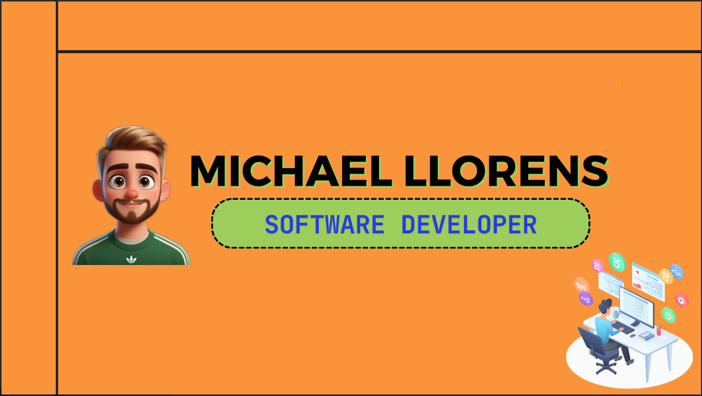
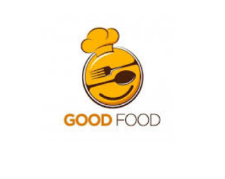
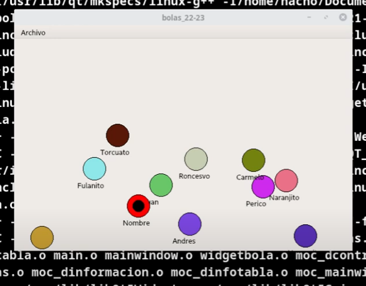
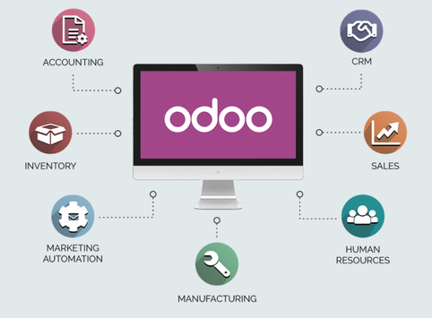

  <h1 align="center">Hi, I'm <a href="https://www.linkedin.com/in/michael-llorens-barbera-32b9272b3/">Michael Llorens</a> 👋</h1>

## 👨‍💻 About Me

I'm a **Full Stack Web Developer** with solid training in Multiplatform Application Development (DAM) and current specialization in Web Application Development (DAW). My professional journey combines practical experience in technology companies with versatile technical expertise spanning from robust backend systems to modern user interfaces.

- 🌐 Full Stack Web Developer (React, Next.js, Node.js, Java, Spring Boot)
- 📱 Mobile App Developer (Android, Kotlin, Firebase)
- 💻 Backend Specialist (Java, Spring Boot, Node.js/Express, REST APIs)
- 🗄️ Database Management (MongoDB, MySQL)
- 🔐 Secure Authentication & Cloud Deployment (JWT, Vercel, MongoDB Atlas)
- 🎓 Currently pursuing Advanced Vocational Training in Web Application Development (DAW)
- 🚀 Passionate about creating efficient, maintainable solutions centered on user experience
- 🌱 Continuously learning new technologies and development methodologies

---

## 💻 Technologies I Work With

### **Languages**

  
  
  
  
  
  

### **Frontend**

  
  
  
  
  

### **Backend & Databases**

  
  
  
  
  
  

### **Mobile & Other**

  
  
  
  
  

---

## 🚀 Featured Projects

### 🍽️ **El Buey Madurado** (Full Stack Restaurant Management System)
*Currently in development*

  

    <strong>A comprehensive full-stack web application for restaurant management.</strong>
  

  

    <strong>Features:</strong> Menu management • Order processing • Table management • Customer reservations • Secure authentication (JWT) • Role-based access • Analytics dashboard
  

  

    
  

  

    
    
    
    
    
  

 
<table>
  <tr> <td width="100%"> <h3 align="center">🍽️ El Buey Madurado (Full Stack)</h3> 
  
  
 
 <strong>Comprehensive full-stack web application</strong> for restaurant management. Features menu management, order processing, table reservation system, customer management, and secure JWT authentication with role-based access. 
 
      
 
 </td> </tr>
<tr>
<td width="50%">
  <h3 align="center">🍲 GoodFood (Kotlin/Android)</h3>
  

    
    

      
    

    

      <strong>Android app</strong> that allows users to discover, share, and manage recipes. Features Firebase authentication, real-time database, and Open Food Facts API integration for nutritional information.
    

    

      
      
      
    

  

</td>

<td width="50%">
  <h3 align="center">🎟️ Cinema Ticket System (Java)</h3>
  
                                       
    
    

      
    

    

      <strong>Java-based system</strong> simulating cinema ticket booking with client-server architecture. Demonstrates socket programming, multithreading, and concurrent user management.
    

    

      
      
      
    

  
                                                       
</tr>
</table>                                                                                 

 

<table>
<tr>
<td width="50%">
<h3 align="center">🎮 Ball Dodging Game (Qt/C++)</h3>

A simple and engaging ball-dodging game developed using QT framework. The player must avoid getting hit by moving balls while the game keeps track of the score and progress.

</td>        

<td width="50%">
  <h3 align="center">🤖 Robot Battle Game (Odoo/Python)</h3>
  

    
    </a>
    

      
    

    

      <strong>Turn-based strategy game</strong> built as a custom Odoo module. Features robot management, weapon equipping, and turn-based combat mechanics integrated with the ERP platform.
    

    

      
      
    

  
                                                                                     
</td>  
</tr>
</table>

---

## 📊 Professional Experience

### **Freelance Developer** | August 2023 - Present
- Full-stack web development for clients
- Modern, responsive interfaces (React, HTML5, CSS3, Tailwind CSS)
- Backend implementation (Node.js, Express)
- Database management (MySQL, MongoDB)
- Performance optimization and API integration

### **Web Developer Intern (FCT)** | Ecommalia | March 2024 - August 2024
- eCommerce platform development (Prestashop, WordPress)
- Module installation and customization
- Performance optimization and debugging
- Data management (Odoo, Amazon systems)

---

## 🎓 Education

### **Higher Degree in Web Application Development (DAW)**
*I.E.S. L'Estació (Ontinyent) | 2024 - Present*
- Subjects: Server-side development, Web deployment, Client-side development, Web interfaces
- Focus: React, Next.js, Node.js, Express, MongoDB, MySQL, JWT, Cloud deployment

### **Higher Degree in Multiplatform Application Development (DAM)**
*I.E.S. Lluis Simarro (Xátiva) | 2022 - 2024*
- Technical training: OOP, multiplatform development (Java, Kotlin, Python, C++)
- Android development, database management, APIs, Spring Boot, Firebase, Odoo

---

## 📞 Let's Connect!

  

    
    
    
    
  

  

    <strong>Phone:</strong> +34 722 169 108 
    <strong>Location:</strong> Valencia, Spain 🇪🇸
  

---

  

    <i>Always open to new opportunities and interesting projects. Let's build something amazing together! 🚀</i>
  

  
  

Con este codigo quiero que el pproyecto de buey esten los textos centrados y qeu solo pongas una descripcion del proyecto y el titulo igual qeu estan los demas pero este al estar el primero y ser impar la lista ocupara el 100% y quiero que enlaces la imagen que esta aqui

[https://github.com/Michael-Llorens/el-buey-madurado/blob/main/public/logo-fondo-blanco.ico](https://github.com/Michael-Llorens/el-buey-madurado/blob/main/public/logo-fondo-blanco.ico)
