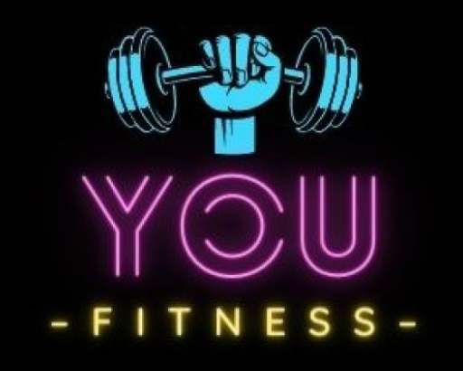

  <h1 align="center">Hi, I'm <a href="https://www.linkedin.com/in/michael-llorens-barbera-32b9272b3/">Michael Llorens</a> 👋</h1>

## 👨‍💻 About Me

- 📲 Mobile App Developer  
- 💻 Web Developer  
- 🧠 Skilled in Java, JavaScript, Python, Kotlin, PHP, and C++  
- 🎓 Recently graduated from the Advanced Vocational Training in Multiplatform Application Development  
- 🚀 Passionate about creating solutions and solving problems through code  
- 🌱 Constantly learning new technologies and work methodologies  

---

## 🚀 My Projects

<table>
<tr>
<td width="50%">
<h3 align="center">💳 Android Banking App (Java)</h3>

An Android app developed in Java that simulates a banking branch. It includes Firebase login, integration with local and external databases, and basic banking operations.

  
  
  

                                                                                  
</td>

<td width="50%">
<h3 align="center">🎟️ Cinema Ticket System</h3>

                                       

A cinema ticket booking simulation using Java Servlets. It includes a GUI for users and thread-based clients to simulate concurrent purchases.

  
  
  

                                                       
</tr>
</table>                                                                                 

 

<table>
<tr>
<td width="50%">
<h3 align="center">🎮 Ball Dodging Game (Qt/C++)</h3>

Arcade-style game where the player must dodge incoming balls. Developed using C++ and Qt, with a custom-designed UI using Qt Designer.

  
  

                                                                                      
</td>       

<td width="50%">
<h3 align="center">🤖 Robot Battle Game (Odoo)</h3>

Turn-based strategy game developed in Odoo using Python models. Players manage robots, equip them with weapons, and engage in battles. Built within the ERP framework.

  
  

                                                                                     
</td>  
</tr>
</table>
 
